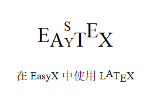

<div align="center">

</div>

## 介绍

不知道各位是否又在 EasyX 中想要显示数学公式却难以实现的困扰呢？而现在，EasyTex， 一个基于 EasyX 的简单的仿 LaTeX 排版引擎，或许可以帮你解决一些问题，EasyTex 非常轻量地实现了一些 LaTeX 中最基本的功能，或许能成为低配版 LaTeX 替代品。

当然，EasyTex 还有很多不足，我会在日后将这些不足完善，希望各位也不要吝啬建议，可以在 GitHub 的 issues 中提出你的看法！

## 使用方法

您可以将 EasyTex 自行编译成 Lib 或者是 Dll，亦或者是你可以在你的项目中加入这两个文件：

```
easytex.cpp
easytex.h
```

就这样，就这么简单~

## 实例

下面是用 EasyTex 渲染一段 LaTeX 内容的实例：

```C++
#include "../easytex.h"

int main()
{
	initgraph(640, 480);
	setbkcolor(WHITE);
	cleardevice();

	BeginBatchDraw();

	TexRender Renderer;
	Renderer.TextHeight = 24;
	Renderer.LineSpacing = 2;

	Renderer.Rendering(
		TEXT(
			R"(
\begin{align}
Base Line 我们构造一个蒙特卡洛积分（Monte\quard Carlo\quard Integration）： \\
F_{N}=\frac{b-a}{N}\sum^{N}_{i=1}f(X_{i}) \\
其中地每一个 X_{i}(i=1,2,3,...,N) 为 [a,b] 之间的均匀连续随机变量。\\
其实 F_{N} 的数学期望即为积分结果 \Alpha E[F_{N}]=E[\frac{b-a}{N}\sum^{N}_{i=1}f(X_{i})] \\
所以有了 \int_{D}f(x)dx=\lim_{N\to\inf}\frac{1}{N}\sum^{N}_{i=1}\frac{f(X_{i})}{p(X_{i})}
\end{align}
)"),
		40, 40);

	FlushBatchDraw();

	getmessage(EM_CHAR);

	return 0;
}ep(8);
	}

	EndBatchDraw();

	return 0;
}
```

运行后，会有如下效果：

<div align="center">
<image src="./Readme-Src/capture.png">
</div>
